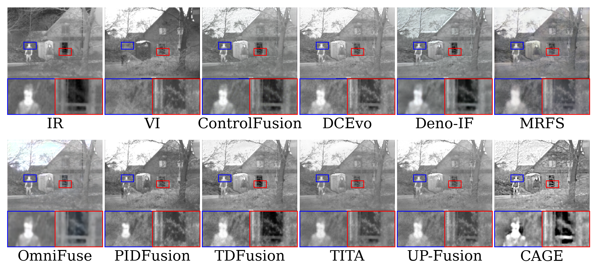
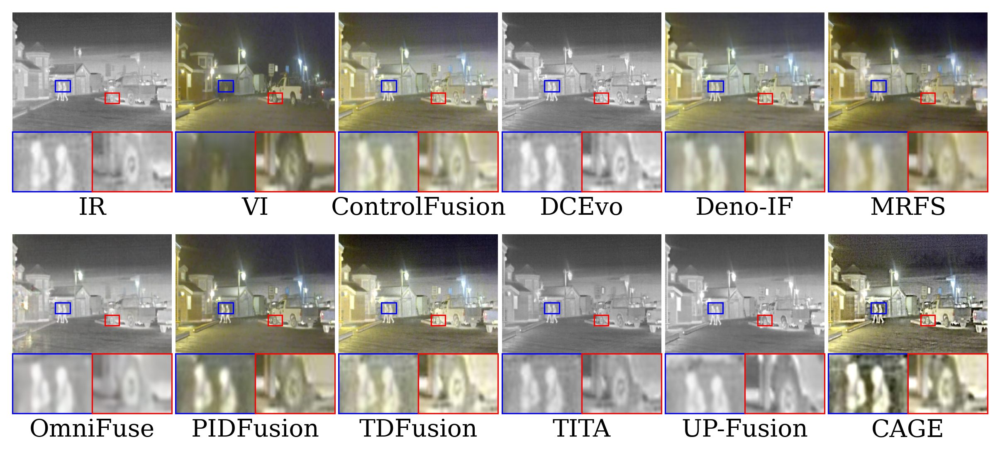
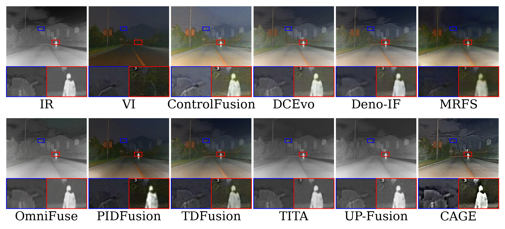
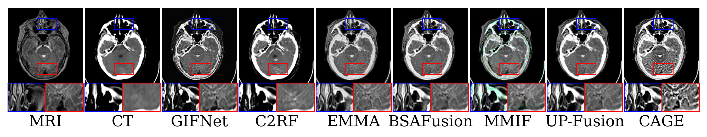
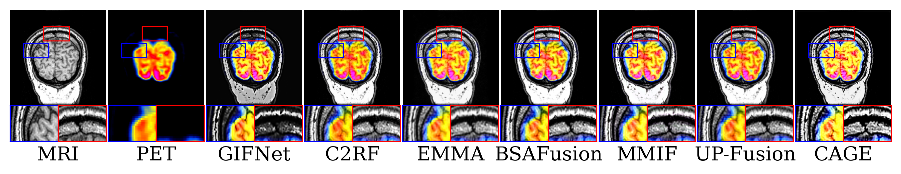
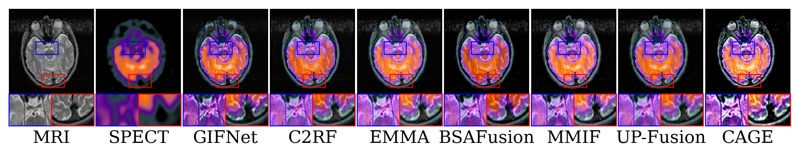

# CAGE: Content-Adaptive Grouped Experts Fusion Network

> **Paper under review. Full code will be released upon acceptance.**
>
> [Supplementary Material](assets/supplementary.pdf)

CAGE is a multi-modal image fusion network that achieves content-adaptivity at every stage of the fusion pipeline. Motivated by the observation that modality dominance varies spatially across an image pair, CAGE introduces three key components:

- **Grouped Mixture of Multi-scale Experts (GMME)**: dynamic routing among scale-specific dilated convolution experts for content-adaptive downsampling.
- **Content-Adaptive Attention Module (CAAM)**: window-level cross-modal attention that activates only where the complementary modality provides genuine informational benefit.
- **Data-driven Spatial Gradient Loss**: window-level adaptive supervision weights derived from local gradient activity ratios.

---

## Quantitative Results

### Infrared-Visible Image Fusion

Metrics: Average Gradient (AG), Edge Intensity (EI), Definition (DF), Visual Information Fidelity for Fusion (VIFF). Higher is better for all metrics.

| Method | Venue | M3FD AG | M3FD EI | M3FD DF | M3FD VIFF | TNO AG | TNO EI | TNO DF | TNO VIFF | Road AG | Road EI | Road DF | Road VIFF |
|:---|:---|:---:|:---:|:---:|:---:|:---:|:---:|:---:|:---:|:---:|:---:|:---:|:---:|
| ControlFusion | NeurIPS'25 | 4.357 | 45.309 | 5.406 | 0.462 | 3.704 | 38.702 | 4.378 | 0.362 | 4.690 | 50.390 | 5.351 | 0.379 |
| DCEvo | CVPR'25 | 4.622 | 48.013 | 5.523 | 0.436 | 4.174 | 42.066 | 5.195 | 0.379 | 5.132 | 53.641 | 6.183 | 0.376 |
| Deno-IF | NeurIPS'25 | 3.723 | 39.636 | 4.291 | 0.522 | 2.995 | 32.353 | 3.244 | 0.508 | 4.682 | 51.063 | 5.060 | 0.514 |
| MRFS | CVPR'24 | 3.402 | 4.584 | 3.857 | <u>0.553</u> | 3.519 | 36.284 | 4.424 | 0.435 | 4.618 | 49.222 | 5.366 | 0.443 |
| OmniFuse | TPAMI'25 | 2.249 | 24.648 | 2.405 | 0.286 | 2.332 | 25.571 | 2.447 | 0.280 | 4.025 | 44.184 | 4.321 | 0.379 |
| PIDFusion | TMM'25 | <u>5.032</u> | <u>52.021</u> | <u>6.068</u> | 0.339 | 4.463 | 44.161 | 5.801 | 0.335 | 4.133 | 43.529 | 4.846 | 0.240 |
| TDFusion | CVPR'25 | 4.880 | 50.658 | 5.829 | 0.558 | <u>4.814</u> | <u>48.292</u> | <u>6.061</u> | **0.635** | <u>6.035</u> | <u>62.904</u> | <u>7.262</u> | **0.630** |
| TITA | ICCV'25 | 4.362 | 45.142 | 5.220 | 0.369 | 3.664 | 36.832 | 4.529 | 0.317 | 4.569 | 47.726 | 5.512 | 0.317 |
| UP-Fusion | AAAI'26 | 4.695 | 48.691 | 5.632 | 0.419 | 3.899 | 39.707 | 4.728 | 0.284 | 4.137 | 43.937 | 4.759 | 0.208 |
| **CAGE** | **Ours** | **7.165** | **74.825** | **8.532** | **0.689** | **5.965** | **62.096** | **6.926** | <u>0.633</u> | **7.974** | **83.568** | **9.495** | <u>0.522</u> |

### Medical Image Fusion (Zero-Shot Generalization)

Model trained on M3FD only, evaluated directly on Harvard Medical datasets without any fine-tuning.

| Method | Venue | CT-MRI AG | CT-MRI EI | CT-MRI DF | CT-MRI VIFF | PET-MRI AG | PET-MRI EI | PET-MRI DF | PET-MRI VIFF | SPECT-MRI AG | SPECT-MRI EI | SPECT-MRI DF | SPECT-MRI VIFF |
|:---|:---|:---:|:---:|:---:|:---:|:---:|:---:|:---:|:---:|:---:|:---:|:---:|:---:|
| BSAFusion | AAAI'25 | 6.695 | 69.014 | 7.858 | 0.410 | <u>11.911</u> | <u>121.445</u> | <u>14.489</u> | 0.546 | <u>6.596</u> | <u>66.684</u> | <u>7.952</u> | 0.546 |
| C2RF | IJCV'25 | 6.411 | 67.277 | 7.336 | 0.381 | 11.153 | 113.854 | 13.547 | 0.539 | 5.869 | 59.287 | 7.105 | 0.492 |
| EMMA | CVPR'24 | 6.499 | 67.262 | 7.558 | 0.445 | 10.618 | 110.333 | 12.542 | 0.552 | 6.138 | 62.520 | 7.369 | 0.606 |
| GIFNet | CVPR'25 | <u>9.313</u> | <u>95.021</u> | <u>10.939</u> | 0.326 | 9.929 | 102.801 | 11.580 | 0.513 | 5.527 | 56.912 | 6.431 | 0.535 |
| MMIF | Inf.Fusion'25 | 7.637 | 78.113 | 9.131 | 0.438 | 11.621 | 119.164 | 14.195 | **0.640** | 6.494 | 65.914 | 7.897 | **0.723** |
| UP-Fusion | AAAI'26 | 6.813 | 70.537 | 7.994 | **0.488** | 10.736 | 110.781 | 13.078 | <u>0.567</u> | 5.558 | 57.072 | 6.754 | 0.599 |
| **CAGE** | **Ours** | **9.733** | **97.996** | **11.827** | <u>0.485</u> | **14.440** | **145.579** | **17.957** | 0.566 | **9.152** | **91.311** | **11.339** | <u>0.624</u> |

### Object Detection on M3FD (YOLOv8m, Zero-Shot)

| Method | People | Motorcycle | Bus | mAP50:95 |
|:---|:---:|:---:|:---:|:---:|
| DCEvo | 0.430 | **0.433** | 0.406 | 0.328 |
| Deno-IF | <u>0.743</u> | 0.308 | 0.672 | 0.413 |
| MRFS | 0.729 | 0.322 | 0.623 | 0.404 |
| OmniFuse | 0.725 | 0.241 | 0.445 | 0.291 |
| PIDFusion | 0.722 | 0.420 | 0.711 | 0.424 |
| TDFusion | 0.739 | 0.406 | <u>0.719</u> | <u>0.432</u> |
| TITA | 0.716 | 0.325 | 0.646 | 0.381 |
| UP-Fusion | 0.735 | 0.375 | 0.656 | 0.396 |
| **CAGE** | **0.753** | <u>0.427</u> | **0.728** | **0.438** |

---

## Qualitative Results

### Infrared-Visible Fusion — TNO Dataset

### Infrared-Visible Fusion — RoadScene Dataset

### Infrared-Visible Fusion — M3FD Dataset

### Object Detection on M3FD

### Medical Image Fusion

#### CT-MRI

#### PET-MRI

#### SPECT-MRI

---

## Citation

*BibTeX entry will be provided upon publication.*
